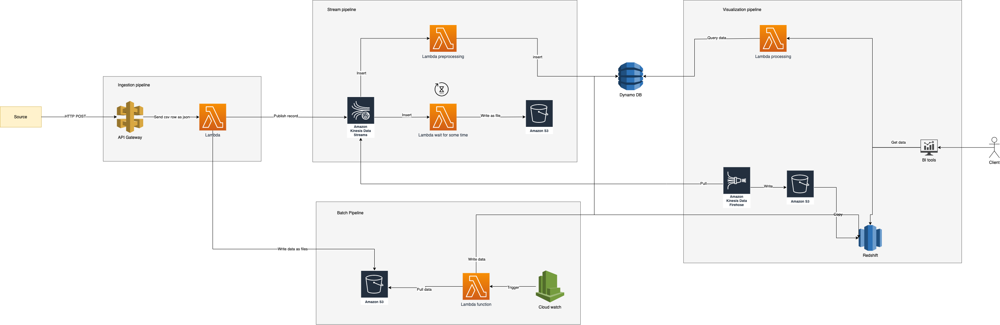

# Data Engineering on AWS

## Introduction
This project aims to take note and show about build up a data pipeline on AWS.

Thank for [Mr Andreas](https://www.linkedin.com/in/andreas-kretz/) who coach me at [The Data Engineering Academy](https://learndataengineering.com/) 

## Data pipeline on AWS (Lambda Architect)

1. Ingestion pipeline:
  - Client send make HTTP request POST data via API Gateway to Lambda function
  - Lambda function write data to Kenesis streaming then response to client

2. Stream pipeline:

    2.1 Stream to raw storage
    - Kenesis send data to Lambda function
    - Lamda function wait for some time before write data to queue to S3 bucket as files
    
    2.2 Stream to DynamoDB pipeline
    - Kenesis trigger lambda function
    - Lambda function reformat or preprocessing messages
    - Lambda function write data to DynamoDB

3. Batch pipeline:
    - Cloud watch trigger Lambda function
    - Bulk import from S3 bucket
    - Lambda function write data to DynamoDB or Redshift
4. Visualization pipeline

    3.1 Client request data
    - Client requets data to view
    - Web UI call Lambda function for processing data
    - Lambda query in DynamoDB to fetch to client

    3.2 Visualize Redshift datawarehouse
    - Kenesis Data Firehose Delivery Stream (KDFDS) connect to pull data from Kenesis Data Stream (KDS)
    - KDFDS write data to temporary storage is S3 bucket
    - Kenesis Firehose copy data from S3 bucket to Redshift
    - BI tool connect to Redshift to visualize data
  

## Keep the things in mind when demo with AWS
